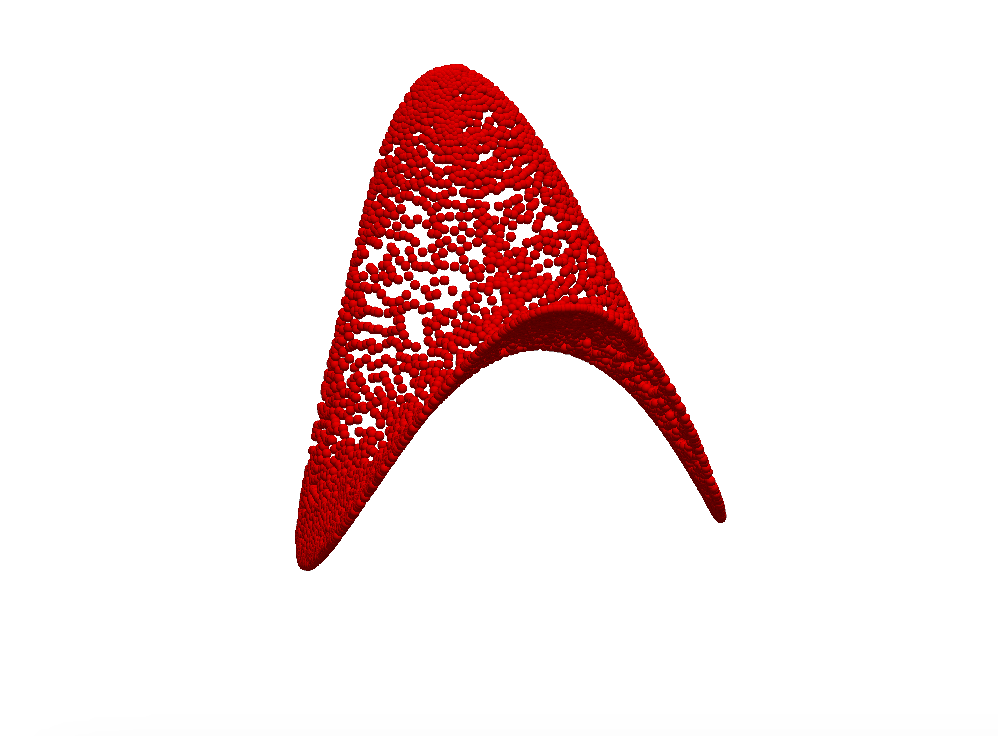

# HDM_Python

In order to run, add the data prepared by Rob. The data directory should be inside HDM_Python, and needs to be named "platyrrhine".
The platyrrhine folder should contain:

- Names.mat
- FinalDist.mat
- softMapMatrix.mat
- ReparametrizedOFF with the .off files inside.

By running HDM.py from within the src folder, you should get the pringle below.

Proof of Concept Pringle (PCP):

open questions:

- Is it okay to assume the all data samples can be in ram at the same time?
- sparsity parameter vs BNN (number neighbors to include)

Times:

- HDM_CPU.py: 101.45s user 18.68s system 505% cpu 23.776 total

TODO:
load data as tensor instead of np array for gpu
