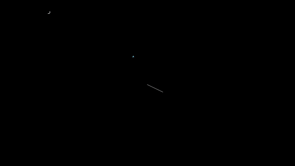

# HDMaps
[](https://github.com/MorphMath/HDMaps/actions/workflows/test.yml)
[](https://opensource.org/licenses/MIT)

**A Python implementation of Horizontal Diffusion Maps (HDM), a manifold learning framework for data analysis of datasets with base-fiber structure.**

## What is HDMaps?

HDM extends diffusion maps to collections of related data objects — shapes, images, point clouds — each carrying its own internal structure. It models the collection as a *fibre bundle*: a base manifold capturing how objects relate to one another, and a fibre over each point representing that object's structure as a noisy realization of a shared template. A random walk on the base is *lifted* across the fibres via correspondences between neighbouring objects, letting HDM organize the objects while consistently registering their internal structure into a shared coordinate system.

<p align="center">
  
  <br>
  <sub><em>A random walk on a neighbor graph on the base manifold (top) lifted through the fibres (bottom): hopping between objects moves to the corresponding point on each object's structure.</em></sub>
</p>


## Installation
To install the latest development version of `HDM_Python` run:
```bash
pip install git+https://github.com/MorphMath/HDMaps
```

## Theory
For a short, accesible overview, see [Introduction to Horizontal Diffusion Maps](docs.md/#theory). For the full treatment, see the [paper](https://www.sciencedirect.com/science/article/pii/S1063520318302215).

## Documentation and Usage

Full documentation is in [docs.md](docs.md). See [examples/](examples/) for usage examples.

## License

This software is licensed under the MIT License. See the [LICENSE](LICENSE) file for details.
